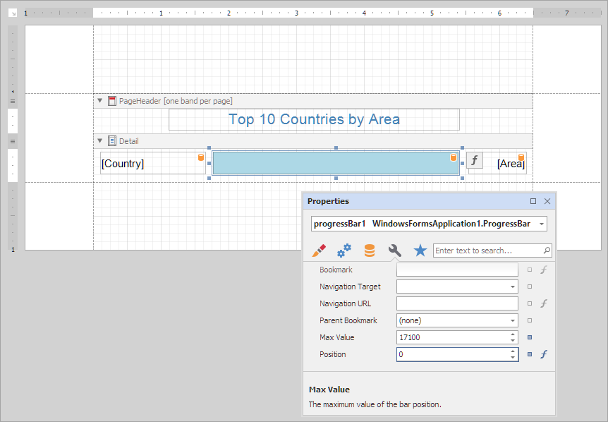
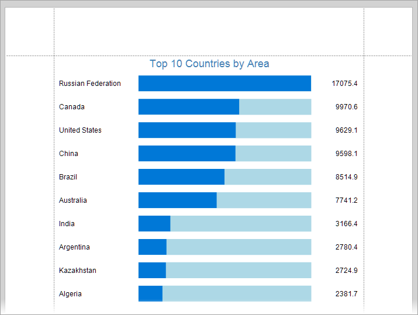

<!-- default badges list -->

<!-- default badges end -->
# Reporting for WinForms - Create a Custom Progress Bar Control

This example demonstrates how to create a custom Progress Bar control and use this control to visualize data.

The report that contains the custom Progress Bar control is shown below:

The report preview is shown in the following image:

## Files to Review

- [ProgressBar.cs](CS/ProgressBar.cs) (VB: [ProgressBar.vb](VB/ProgressBar.vb))

## Documentation

- [Create a Custom Control Inherited From XRControl](https://docs.devexpress.com/XtraReports/1304)
- [Use Custom Controls](https://docs.devexpress.com/XtraReports/2607/detailed-guide-to-devexpress-reporting/use-report-controls/use-custom-controls)

## More Examples

- [How to Create a Custom DevExpress Report Control](https://github.com/DevExpress-Examples/Reporting-Custom-Controls)
<!-- feedback -->
## Does this example address your development requirements/objectives?

 

(you will be redirected to DevExpress.com to submit your response)
<!-- feedback end -->
