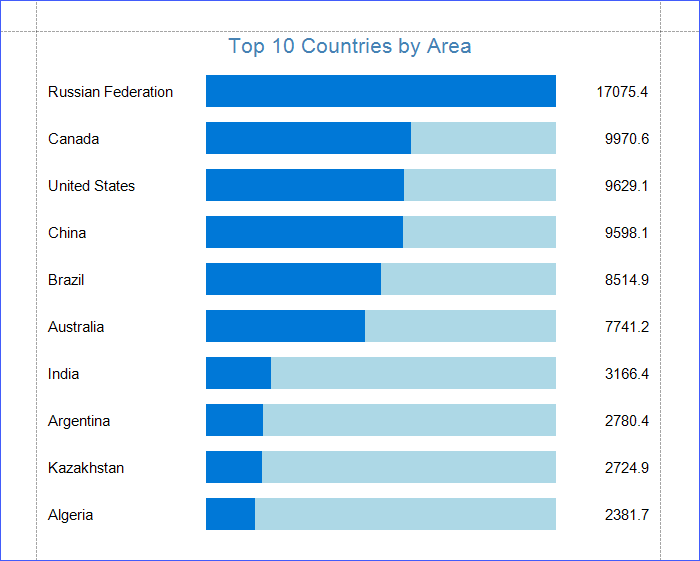

# Create a Custom Progress Bar Control

This example demonstrates how to create a custom progress bar control and use this control to visualize the countries' areas.

Files to look at:

* [ProgressBar.cs](https://github.com/DevExpress-Examples/Reporting_how-to-create-custom-report-controls-e57/blob/2020.2/CS/ProgressBar.cs) ([ProgressBar.vb](https://github.com/DevExpress-Examples/Reporting_how-to-create-custom-report-controls-e57/blob/2020.2/VB/ProgressBar.vb)).

Refer to the following topic for more details: [Create a Custom Control from Scratch](https://docs.devexpress.com/XtraReports/1304).

